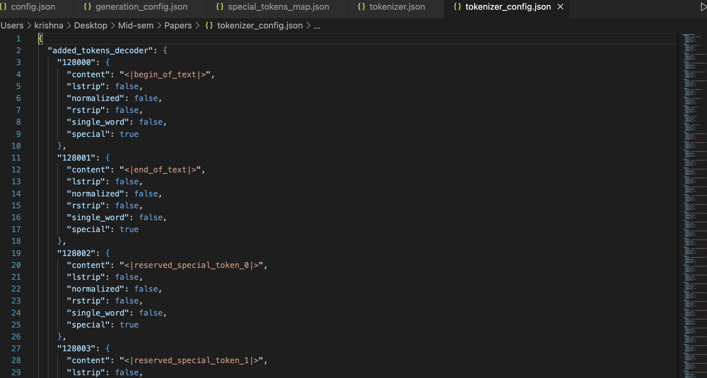

This blog post demonstrates how to replicate the behavior of ChatGPT using Meta’s **LLaMA 3.2 1B Instruct** model through the 🤗 Hugging Face `transformers` library.

In this educational walkthrough, you'll learn how to:

- Set up a text generation pipeline
- Format system/user prompts using a custom chat template
- Tokenize input using LLaMA’s tokenizer
- Generate and decode model responses
- Peek into model internals: weights, tokenizer settings, generation configs

> 📌 **Use Case**: Ideal for learners and developers curious about how instruction-following LLMs like ChatGPT work under the hood.

---

### 🔧 Requirements

- `transformers`
- `torch`
- `Hugging Face account with access token`

### 🚀 Model Used

`meta-llama/Llama-3.2-1B-Instruct`

## 🔍 LLMs Behind the API Key

### 💬 ChatGPT

[ChatGPT](https://openai.com/chatgpt) is a **Large Language Model (LLM)** developed by [OpenAI](https://openai.com), built on the [GPT (Generative Pre-trained Transformer)](https://en.wikipedia.org/wiki/Generative_pre-trained_transformer) architecture. It’s designed to generate human-like responses to text input, making it versatile for a range of tasks like answering questions, providing recommendations, and even engaging in casual conversation.


By leveraging extensive training on diverse datasets, ChatGPT can generate coherent and contextually relevant replies based on the input it receives.

> 🖼️ *In the screenshot below, you’ll see an example of how users interact with ChatGPT by asking it a question, and how it responds using its pre-trained knowledge.*


## 🚀 From ChatGPT to the Hugging Face Pipeline: The Inner Workings

While ChatGPT provides an easy-to-use interface for interacting with a language model, there’s a lot happening behind the scenes. To understand how the magic works, let’s dive deeper into how large language models (LLMs) are deployed using frameworks like Hugging Face’s `transformers` library.

### 🤗 Hugging Face

[**Hugging Face**](https://huggingface.co) is an open-source platform and community for Natural Language Processing (NLP), offering a vast collection of pre-trained models and tools to streamline AI development.

Its [`transformers`](https://huggingface.co/docs/transformers/index) library provides easy access to cutting-edge large language models like [**GPT**](https://en.wikipedia.org/wiki/Generative_pre-trained_transformer), [**BERT**](https://en.wikipedia.org/wiki/BERT_(language_model)), and [**LLaMA**](https://huggingface.co/meta-llama) for tasks such as:


- ✅ Text generation
- ✅ Classification
- ✅ Translation
- ✅ Question answering

---

### 🦙 Using the Meta LLaMA Instruct Model with Hugging Face

To replicate the internal workings of ChatGPT, we use **Meta's LLaMA Instruct model**, particularly the **LLaMA 3.2 1B** version — fine-tuned for instruction-following tasks.

This model is designed to:

- Understand system/user prompts
- Generate responses based on context
- Handle conversational flows

---

### 🧪 Loading LLaMA Instruct 3.2 1B in Hugging Face's Text Generation Pipeline

Let’s now look at how to load and use the [**LLaMA Instruct**](https://huggingface.co/meta-llama/Llama-3.2-1B-Instruct) model with [Hugging Face's `pipeline()`](https://huggingface.co/docs/transformers/main_classes/pipelines#transformers.pipeline) function for [text generation](https://huggingface.co/docs/transformers/task_summary#text-generation).

> 🔍 This gives us a close approximation to how ChatGPT-style systems work under the hood!

### 🔐 Step 1: Authenticate with Hugging Face

To use [Hugging Face](https://huggingface.co/) models, you need to authenticate using your [personal access token](https://huggingface.co/docs/hub/security-tokens).

```python
from huggingface_hub import login
# Replace 'your_access_token' with your actual Hugging Face token
login("your_access_token")
```
Output
```text
The token has not been saved to the git credentials helper. Pass `add_to_git_credential=True` in this function directly or `--add-to-git-credential` if using via `huggingface-cli` if you want to set the git credential as well.
Token is valid (permission: write).
Your token has been saved to /root/.cache/huggingface/token
Login successful
```
```python
import torch
from transformers import pipeline

model_id = "meta-llama/Llama-3.2-1B-Instruct"
pipe = pipeline(
    "text-generation",
    model=model_id,
    torch_dtype=torch.bfloat16,
    device = 0
)


messages = [
    {"role": "system", "content": "You are an intelligent assistant trained to follow user instructions and provide accurate, concise, and helpful responses."},
    {"role": "user", "content": "write 3 lines about transfromers in llms"},
]

outputs = pipe(
    messages,
    max_new_tokens=256,
)
print(outputs[0]["generated_text"][-1]['content'])
```

Output
```text
Setting `pad_token_id` to `eos_token_id`:128001 for open-end generation.
Here are three lines about transformers in LLMs (Large Language Models):

Transformers in LLMs are a type of neural network architecture that enables efficient and effective natural language processing tasks, such as text classification, sentiment analysis, and machine translation. These models consist of multiple layers of self-attention mechanisms, enabling them to process sequential data in parallel and learn complex patterns. By leveraging the strengths of transformers, LLMs have become a popular choice for a wide range of applications, including language translation, question answering, and text summarization.
```

### 🧠 **Behind the Pipeline: How It Works**

1. **Define the Chat Template**  
   A structured message format is prepared with roles like `system` and `user`. This ensures the model follows the conversation context properly.

2. **Tokenization**  
   The input text is broken into smaller units called *tokens* (e.g., words, subwords, or characters). This is necessary for the model to process text effectively.

3. **Model Processing**  
   The tokens are fed into the **LLaMA** model, which uses its pre-trained knowledge and a **transformer architecture** with *self-attention* to understand the context and relationships between tokens.

4. **Text Generation**  
   The model predicts the next tokens iteratively, using *sampling techniques* like **top-k** and **top-p** to ensure coherent and diverse outputs.

5. **Detokenization**  
   The generated tokens are converted back into readable text to form the final response.

```python
import torch
from transformers import AutoModelForCausalLM, AutoTokenizer
model_id = "meta-llama/Llama-3.2-1B-Instruct"

model = AutoModelForCausalLM.from_pretrained(model_id)
tokenizer = AutoTokenizer.from_pretrained(model_id)
model.to('cuda')

messages = [
    {"role": "system", "content": "You are an intelligent assistant trained to follow user instructions and provide accurate, concise, and helpful responses."},
    {"role": "user", "content": "write 3 lines about transfromers in llms"},
]


# 2: Apply the chat template
formatted_chat = tokenizer.apply_chat_template(messages, tokenize=False, add_generation_prompt=True)


# 3: Tokenize the chat (This can be combined with the previous step using tokenize=True)
inputs = tokenizer(formatted_chat, return_tensors="pt", add_special_tokens=False)


# Move the tokenized inputs to the same device the model is on (GPU/CPU)
inputs = {key: tensor.to(model.device) for key, tensor in inputs.items()}


# 4: Generate text from the model
outputs = model.generate(**inputs, max_new_tokens=512, temperature=0.1)


# 5: Decode the output back to a string
decoded_output = tokenizer.decode(outputs[0][inputs['input_ids'].size(1):], skip_special_tokens=True)
```
```python
print(decoded_output)
```
Output
```text
Here are three lines about transformers in LLMs:

Transformers in Large Language Models (LLMs) are a type of neural network architecture that enables them to process and understand complex linguistic relationships. They are particularly effective in tasks such as language translation, text summarization, and question-answering. By leveraging the power of self-attention mechanisms and position embeddings, LLMs with transformer architectures can generate highly accurate and coherent text outputs.
```

### 🧪 **Let’s Dive In: Understanding Each Step**

1. **Prompt Template**  
   The prompt template defines the structure of the conversation, including roles like **system** (instructions for the assistant) and **user** (the input question).  
   This helps guide the model to generate responses effectively.

   The tokenizer used by Hugging Face only accepts `str` input — not `dict`.  
   Applying a **chat template** converts the structured message into a formatted string internally before tokenization.

```python
messages = [
    {"role": "system", "content": "You are an intelligent assistant trained to follow user instructions and provide accurate, concise, and helpful responses."},
    {"role": "user", "content": "write 3 lines about transfromers in llms"},
]

# 2: Apply the chat template
formatted_chat = tokenizer.apply_chat_template(messages, tokenize=False, add_generation_prompt=True)
print(formatted_chat)
```
```text
<|begin_of_text|><|start_header_id|>system<|end_header_id|>

Cutting Knowledge Date: December 2023
Today Date: 26 Jul 2024

You are an intelligent assistant trained to follow user instructions and provide accurate, concise, and helpful responses.<|eot_id|><|start_header_id|>user<|end_header_id|>

write 3 lines about transfromers in llms<|eot_id|><|start_header_id|>assistant<|end_header_id|>
```
This formatted string is what the model processes, including system, user, and assistant tags

2. **Tokenization**  
   The tokenizer converts the prompt template into **numerical tokens** that the model can understand.  
   Tokens represent the text in smaller chunks such as **subwords**, **words**, or **characters**, depending on the tokenizer design.

```python
# 3: Tokenize the chat (This can be combined with the previous step using tokenize=True)
inputs = tokenizer(formatted_chat, return_tensors="pt", add_special_tokens=False)

print(f"The tokenized inputs are :\n\n{inputs['input_ids']}")

print("\n")

print(f"The attention mask :\n\n{inputs['attention_mask']}")
```
```text
The tokenized inputs are :

tensor([[128000, 128006,   9125, 128007,    271,  38766,   1303,  33025,   2696,
             25,   6790,    220,   2366,     18,    198,  15724,   2696,     25,
            220,   1627,  10263,    220,   2366,     19,    271,   2675,    527,
            459,  25530,  18328,  16572,    311,   1833,   1217,  11470,    323,
           3493,  13687,     11,  64694,     11,    323,  11190,  14847,     13,
         128009, 128006,    882, 128007,    271,   5040,    220,     18,   5238,
            922,   1380,   1527,    388,    304,   9507,   1026, 128009, 128006,
          78191, 128007,    271]])


The attention mask :

tensor([[1, 1, 1, 1, 1, 1, 1, 1, 1, 1, 1, 1, 1, 1, 1, 1, 1, 1, 1, 1, 1, 1, 1, 1,
         1, 1, 1, 1, 1, 1, 1, 1, 1, 1, 1, 1, 1, 1, 1, 1, 1, 1, 1, 1, 1, 1, 1, 1,
         1, 1, 1, 1, 1, 1, 1, 1, 1, 1, 1, 1, 1, 1, 1, 1, 1, 1]])
```
### 🔢 **Tokenization: Translating Text into Numbers for the Model**

Tokenization is the process of breaking down text into smaller units called **tokens**, which can be words, subwords, or even characters.  
Each token is then mapped to a unique **numerical ID** that the model can process.

This step is crucial because models like **LLaMA** operate on **numerical data** rather than raw text.  
By understanding the token-to-ID mapping, we can see how the input text is transformed into a format the model can “read” and process effectively.

Let’s now see how each token is converted into numbers.
```python
for i in range(len(inputs['input_ids'][0])):
    # print(inputs['input_ids'][i])
    print(f"{inputs['input_ids'][0][i]} ---------->  {tokenizer.decode(inputs['input_ids'][0][i])}\n")
```
Output
```text
128000 ---------->  <|begin_of_text|>
128006 ---------->  <|start_header_id|>
9125   ---------->  system
...
78191 ---------->  assistant
128007 ---------->  <|end_header_id|>
```
### 3. **Text Generation**

Once the input has been tokenized and passed through the model, the **text generation** process begins.

The model uses its **pre-trained knowledge** and the **context provided by the prompt** to predict the next tokens step by step. This involves sampling strategies like:

- **Greedy search** – picks the most likely next token.
- **Top-k sampling** – samples from the top *k* most likely tokens.
- **Top-p (nucleus) sampling** – samples from the smallest set of tokens whose cumulative probability exceeds *p*.

These strategies ensure that the model generates **coherent, diverse, and context-aware responses**, rather than repeating generic or deterministic answers.

This is essentially the _"magic moment"_ where your input transforms into intelligent, human-like output.

```python
# Move the tokenized inputs to the same device the model is on (GPU/CPU)
inputs = {key: tensor.to(model.device) for key, tensor in inputs.items()}

outputs = model.generate(**inputs, max_new_tokens=512, temperature=0.1)
print(outputs)
```
Output
```text
tensor([[128000, 128006,   9125, 128007,    271,  38766,   1303,  33025,   2696,
             25,   6790,    220,   2366,     18,    198,  15724,   2696,     25,
            220,   1627,  10263,    220,   2366,     19,    271,   2675,    527,
            459,  25530,  18328,  16572,    311,   1833,   1217,  11470,    323,
           3493,  13687,     11,  64694,     11,    323,  11190,  14847,     13,
         128009, 128006,    882, 128007,    271,   5040,    220,     18,   5238,
            922,   1380,   1527,    388,    304,   9507,   1026, 128009, 128006,
          78191, 128007,    271,   8586,    527,   2380,   5238,    922,  87970,
            304,    445,  11237,     82,   1473,   9140,    388,    304,  20902,
          11688,  27972,    320,   4178,  22365,      8,    527,    264,    955,
            315,  30828,   4009,  18112,    430,  20682,   1124,    311,   1920,
            323,   3619,   6485,  65767,  12135,     13,   2435,    527,   8104,
           7524,    304,   9256,   1778,    439,   4221,  14807,     11,   1495,
          29385,   2065,     11,    323,   3488,     12,    598,     86,   4776,
             13,   3296,  77582,    279,   2410,    315,    659,     12,  54203,
          24717,    323,   2361,  71647,     11,    445,  11237,     82,    449,
          43678,  78335,    649,   7068,   7701,  13687,    323,  56887,  16674,
             13, 128009]], device='cuda:0')
```
```python
print(tokenizer.decode(outputs[0], skip_special_tokens=True))
```
Output

```text
system

Cutting Knowledge Date: December 2023
Today Date: 26 Jul 2024

You are an intelligent assistant trained to follow user instructions and provide accurate, concise, and helpful responses.user

write 3 lines about transfromers in llmsassistant

Here are three lines about transformers in LLMs:

Transformers in Large Language Models (LLMs) are a type of neural network architecture that enables them to process and understand complex linguistic relationships. They are particularly effective in tasks such as language translation, text summarization, and question-answering. By leveraging the power of self-attention mechanisms and position embeddings, LLMs with transformer architectures can generate highly accurate and coherent outputs.
```
## Unpacking the Files: Inside a Hugging Face Model Directory
Let's find what's happening inside when you load a model from hugging face using `model_id = "meta-llama/Llama-3.2-1B-Instruct"`

after this model it will fetch all the required files from the repository


*Figure: Files automatically downloaded when loading `meta-llama/Llama-3.2-1B-Instruct` from Hugging Face.*

### Loading Models from the Local Folder

You can load models either from the **Hugging Face Model Hub** or from your **local file path**.  
This is especially useful if you want to run everything completely offline—without requiring internet access after the initial download.

Let's take a closer look at each file:

#### The Model Files

These files define the neural network structure and store the pre-trained weights.

- **`pytorch_model.bin`** or **`model.safetensors`**  
  Contains the pre-trained weights of the model in binary format.  
  This file is the largest because it holds all the learned parameters.  
  *Example:* ~2 GB (1 Billion Parameters) for smaller models, but can go up to hundreds of GBs for larger models.

```python
model
```
output
```text
LlamaForCausalLM(
  (model): LlamaModel(
    (embed_tokens): Embedding(128256, 2048)
    (layers): ModuleList(
      (0-15): 16 x LlamaDecoderLayer(
        (self_attn): LlamaSdpaAttention(
          (q_proj): Linear(in_features=2048, out_features=2048, bias=False)
          (k_proj): Linear(in_features=2048, out_features=512, bias=False)
          (v_proj): Linear(in_features=2048, out_features=512, bias=False)
          (o_proj): Linear(in_features=2048, out_features=2048, bias=False)
          (rotary_emb): LlamaRotaryEmbedding()
        )
        (mlp): LlamaMLP(
          (gate_proj): Linear(in_features=2048, out_features=8192, bias=False)
          (up_proj): Linear(in_features=2048, out_features=8192, bias=False)
          (down_proj): Linear(in_features=8192, out_features=2048, bias=False)
          (act_fn): SiLU()
        )
        (input_layernorm): LlamaRMSNorm((2048,), eps=1e-05)
        (post_attention_layernorm): LlamaRMSNorm((2048,), eps=1e-05)
      )
    )
    (norm): LlamaRMSNorm((2048,), eps=1e-05)
    (rotary_emb): LlamaRotaryEmbedding()
  )
  (lm_head): Linear(in_features=2048, out_features=128256, bias=False)
)
```

### 1. Configuration (`config.json`)
- **Defines model architecture**: Specifies parameters like the number of layers, attention heads, and hidden size.  
- **Guides model initialization**: Used to correctly build the model's structure based on predefined settings.  
- **Essential for loading**: Without it, the model would not know how to configure itself or how to process inputs correctly.


### 2. Generation Configuration (`generation_config.json`)
- **Controls text generation settings**: Defines parameters like maximum output length, sampling methods, and temperature for generating text.  
- **Tuning generation behavior**: Parameters like `temperature`, `top_k`, and `top_p` control creativity, randomness, and diversity in the model's responses.  
- **Used during inference**: This configuration guides how the model generates new text after receiving an input prompt.


### 3. Special Tokens Map (`special_tokens_map.json`)
- **Maps special tokens to IDs**: Defines how special tokens (e.g., `<pad>`, `<bos>`, `<eos>`) are represented in the model’s vocabulary.  
- **Guides tokenization and detokenization**: Ensures that special tokens are handled correctly during both text processing and generation.  
- **Facilitates model understanding**: Helps the model distinguish between different types of tokens, such as padding, beginning-of-sequence, or end-of-sequence markers.


### 4. Tokenizer JSON (`tokenizer.json`)
- **Stores tokenizer vocabulary**: Contains the mappings of tokens (e.g., words or subwords) to numerical IDs used by the model.  
- **Defines tokenization rules**: Includes information on how input text should be split and encoded into tokens, and how to handle special tokens.  
- **Ensures consistency**: The same `tokenizer.json` file must be used during both training and inference to guarantee correct tokenization and detokenization.


### 5. Tokenizer Configuration (`tokenizer_config.json`)
- **Stores tokenizer settings**: Includes parameters such as maximum sequence length, padding behavior, and truncation options.  
- **Defines special tokens**: Maps special tokens like `<bos>`, `<eos>`, `<pad>`, and `<unk>` to their respective IDs, ensuring consistent processing.  
- **Controls tokenization behavior**: Helps fine-tune how input text is processed, ensuring that tokens are handled appropriately for model inference.



---

## ✅ Conclusion

In this blog, we explored the internal workings of ChatGPT-style models using Meta’s LLaMA 3.2 1B Instruct model. By replicating the behavior of a chat pipeline using Hugging Face’s `transformers` library, we gained insight into:

- How prompt templates guide model behavior  
- The process of tokenization and detokenization  
- How LLaMA models generate coherent responses  
- The significance of configuration files within the model directory  

Understanding these components gives you a deeper appreciation of what happens behind the scenes when you interact with tools like ChatGPT. Whether you're deploying models locally or using the Hugging Face hub, this knowledge empowers you to fine-tune, customize, or debug LLM behavior effectively.

Stay tuned for more deep dives into LLM internals and practical AI workflows 🚀

---
📘 **View the Full Notebook on GitHub**

If you'd like to explore the code and outputs interactively, you can find the complete Jupyter Notebook here:

🔗 [LLM ChatGPT Pipeline Notebook on GitHub](https://github.com/rmkrishna91/under-the-hood-llms)


