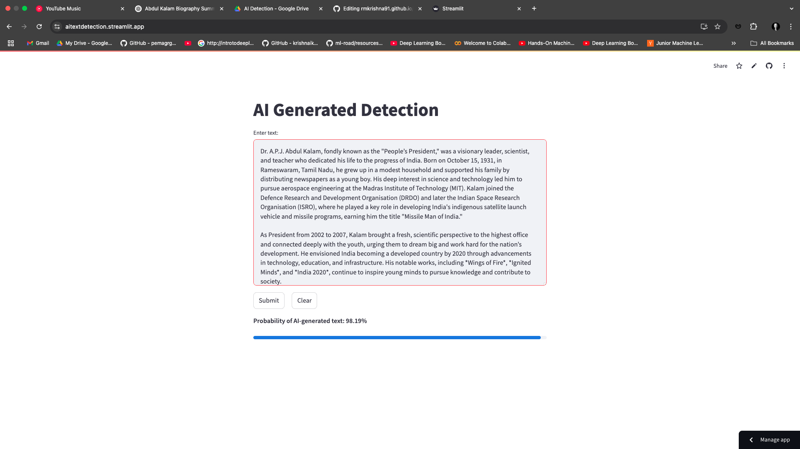

## AI-Generated Text Detection  
This project is designed to classify text as either AI-generated or human-written using deep learning techniques. It combines text embeddings with numerical linguistic features to improve accuracy.

### Features  
- Uses **Sentence Transformers** for text embeddings  
- Incorporates **27 linguistic features** for enhanced classification  
- Built with **PyTorch and Streamlit** for an interactive user interface  
- Real-time text analysis with **probability scores**  

### Technologies Used  
- **Python, PyTorch, NLP models**  
- **Streamlit UI for real-time interaction**  
- **Scikit-learn for feature engineering**  

### Demo  
  
*(Click on the image to watch the demo.)*  

### Screenshots  
  

### Links  
- **GitHub Repository**: [View on GitHub](https://github.com/your-github-username/your-repo)  
- **Live Demo**: [Try it here](https://aitextdetection.streamlit.app/)  
